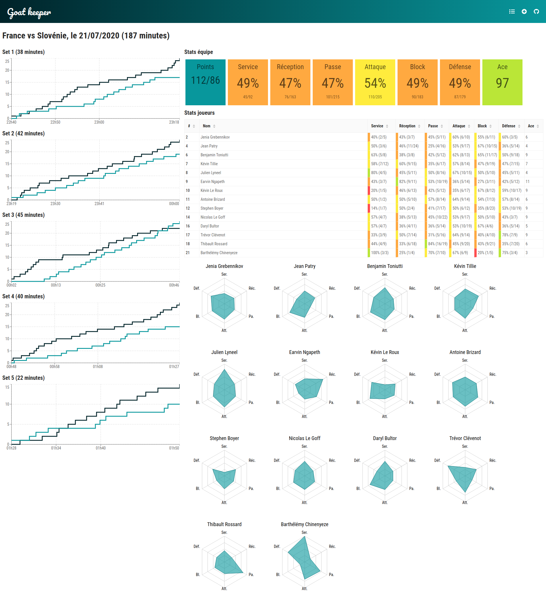

# Goat Keeper 🏐 🐐

https://florianmo.github.io/goat-keeper/

(don't F5, Github pages deployment does not play well with client side routing)

Goat keeper is a volleyball score and stats tracker. Its main purpose is to play around with various tools. Its secondary purpose is to convince my team mates to actually track score and stats for my volleyball team and blame using big data :).

It is built with :

- [TypeScript](https://www.typescriptlang.org/)
- [React](https://reactjs.org/)
- [create-react-app](https://create-react-app.dev/)
- [react-router](https://reactrouter.com/)
- [react-redux](https://react-redux.js.org/)
- [redux-toolkit](https://redux-toolkit.js.org/)
- [redux-persist](https://github.com/rt2zz/redux-persist)
- [Ant Design](https://ant.design/)
- [styled components](https://styled-components.com/)
- [Recharts](https://recharts.org/)
- [Font Awesome](https://fontawesome.com/)
- [Day.js](https://github.com/iamkun/dayjs)
- [Prettier](https://prettier.io/)
- [ESLint](https://eslint.org/)

Define a new game, specifying teams names and your team's players, then track scores and game events for your team (only), giving an event type (service, attack, dig...), the outcome (successful or failed) and a player.

Data is stored in [local storage](https://developer.mozilla.org/en-US/docs/Web/API/Window/localStorage), through [react-redux](https://react-redux.js.org/) and [redux-persist](https://github.com/rt2zz/redux-persist). The idea is to allow users to export games data in a JSON file, and to be able to import it back on any device.

You can visualize game statistics :

- score evolution for each set (line charts)
- statistics for each player and each event type (total, successful, percentage)
- statistics for the whole team
- more ideas to come :)

  

  

 

